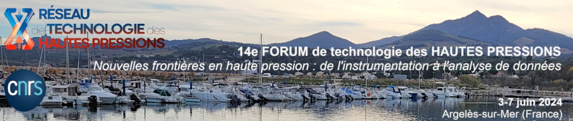

# Atelier "Python pour l’analyse des données haute pression"

__[14e Forum de technologie des hautes pressions](https://forumhp2024.sciencesconf.org/)__

__Nouvelles frontières en haute pression : de l'instrumentation à l'analyse de données__

__3-7 juin 2024 - Argelès-sur-Mer__

Cet atelier propose une initiation à l'analyse de données en utilisant le langage de programmation Python, adapté au contexte des expériences haute pression. L’objectif est de montrer un aperçu des vastes possibilités et de fournir des informations utiles à la fois pour les débutants et les utilisateurs confirmés, sans se focaliser sur la syntaxe du langage. Python bénéficie d’une grande popularité et est très utilisé dans la gestion et l'analyse de données, ainsi que pour le pilotage des expériences sur grands instruments (ESRF, Soleil...). Il figure désormais parmi les langages les plus enseignés aux étudiants en sciences.

# Ressources 

* Slides de présentation. 
* [Tutoriel d'installation de python et de packages additionnels](installation.md)
* Fit d'un spectre de luminescence du rubis. [Visualiser](https://github.com/alexisforestier/Atelier-Python-HP/blob/main/Rubis_demo_fit/Rubis_demo.ipynb) [Télécharger](https://github.com/alexisforestier/Atelier-Python-HP/tree/main/Rubis_demo_fit)
* Analyse d'un spectre de rayonnement de corps noir. [Visualiser](https://github.com/alexisforestier/Atelier-Python-HP/blob/main/Corps_Noir_demo_fit/Corps_Noir_demo.ipynb) [Télécharger](https://github.com/alexisforestier/Atelier-Python-HP/tree/main/Corps_Noir_demo_fit)
* Ouverture et intégration azimuthale d'une plaque image de diffraction des rayons X au format HDF5 (.h5) [Visualiser](https://github.com/alexisforestier/Atelier-Python-HP/blob/main/Plaque_image_XRD_demo/Plaque_image_h5.ipynb) [Télécharger](https://github.com/alexisforestier/Atelier-Python-HP/tree/main/Plaque_image_XRD_demo)

# Autres ressources utiles

### Bases

* [Les bases de python sur *courspython.com* : les types natifs, les boucles et les tests, fonctions et opérateurs...](https://courspython.com/bases-python.html)
* [Les bases de la manipulation de tableaux `numpy` (documentation de `numpy`)](https://numpy.org/doc/stable/user/absolute_beginners.html)
* [La librairie `pandas`, utilisation du type `DataFrame`](https://pandas.pydata.org/docs/user_guide/index.html)
* [Types mutables et non-mutables](https://bouquinpython.readthedocs.io/fr/latest/mutabilite.html)
* [Quelques bases de programmation orientée objet sur *courspython.com* :](https://courspython.com/classes-et-objets.html)

### Quelques programmes

* __Dioptas__, programme graphique très complet (écrit en python + Qt) pour l'analyse des données de diffraction des rayons X sous haute pression : [Dioptas](https://www.clemensprescher.com/programs/dioptas)
* __Amorpheus__, un programme python pour l'analyse des données de diffraction des rayons X sur les liquides et solides amorphes : [Amorpheus](https://github.com/CelluleProjet/Amorpheus), voir aussi la publication associée : [Boccato et al. High Pressure Research 2022, vol. 42, No. 1, 69–93](https://www.tandfonline.com/doi/full/10.1080/08957959.2022.2032032)
* __myPGM__, un outil avec interface graphique écrit en python avec Qt pour le post-traitement (fit...) des mesures spectroscopiques de jauges de pression (rubis, samarium, Raman du nitrure de bore cubique, edge Raman du diamant, vibron H2) :  [myPGM](https://github.com/AHilberer/myPGM)
* __RubyCond__, un outil graphique pour la mesure de pression avec la luminescence du rubis, avec pilotage en direct du spectromètre OceanOptics (écrit en python + tkinter) : [RubyCond](https://github.com/CelluleProjet/Rubycond)
* __h5temperature__, un outil graphique (écrit en python + Qt) pour l'analyse des mesures de température par pyrométrie optique de l'ESRF au format h5 : [h5temperature](https://github.com/alexisforestier/h5temperature)

### Tracé de graphiques

* [Guide de l'utilisateur `matplotlib`](https://matplotlib.org/stable/users/index.html)
* [Galerie d'exemples de graphiques `matplotlib`](https://matplotlib.org/stable/gallery/index.html)
* [Liste des noms de couleurs `matplotlib`](https://matplotlib.org/stable/gallery/color/named_colors.html#css-colors)
* [Liste des types de symboles `matplotlib`](https://matplotlib.org/stable/api/markers_api.html)
* Une autre bilbiothèque qui permet de réaliser des graphiques interactifs : [`plotly`](https://plotly.com/python/)
* D'autres bibliothèques pour le tracé graphique, `Seaborn` et `Bokeh` : [Galerie d'exemples de Seaborn](https://seaborn.pydata.org/examples/index.html), [Galerie d'exemples de Bokeh](https://docs.bokeh.org/en/latest/docs/gallery.html)

### Fichiers au format HDF5

* Un outil avec interface graphique pour visualiser l'arborescence de fichiers h5 : [ViTables](https://vitables.org/)
* Un autre outil avec de nombreuses fonctionnalités pour l'analyse des données : [PyMca](http://www.silx.org/doc/PyMca/dev/index.html)
* [Accéder au contenu d'un fichier h5 avec la librairie `h5py`](https://docs.h5py.org/en/stable/quick.html)

### Générer des executables

* Le package `PyInstaller` permet de créer des executables à partir de codes python (utilisé notemment par Dioptas) : [page officielle et documentation](https://pyinstaller.org/en/stable/) 

### Contacts

* **Alexis FORESTIER**,  *alexis.forestier@cea.fr*
* **Antoine HILBERER**,  *antoine.hilberer@cea.fr* 
* **Yiuri GARINO**,      *yiuri.garino@cnrs.fr*     
* **Silvia BOCCATO**,    *silvia.boccato@cnrs.fr* 

