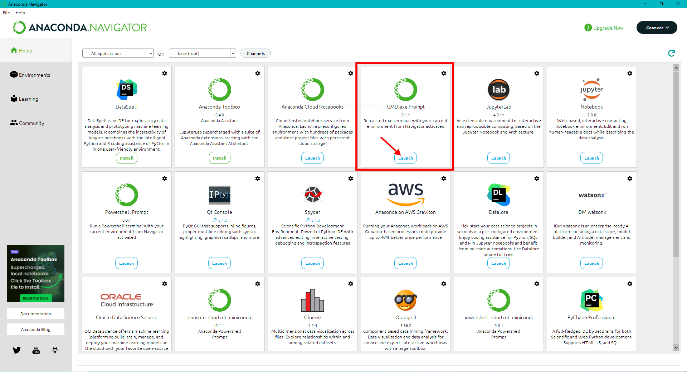

# Python Installation with conda distribution
## The easiest way  

1) Download __Anaconda__ installer from the official website: [https://www.anaconda.com/download/success](https://www.anaconda.com/download/success).


2) Run the installer and follow the steps without changing any options, unless:
If your **username** on Windows contains spaces, do not install in the default directory (C:\Users\username\anaconda3). If your **username** contains spaces, change the installation directory to "C:\Anaconda".


3) You now have a new software called __Anaconda Navigator__ in the startup menu. Launch it. You will see a number of different applications that you can use:


We are mainly interested in __Spyder__ and __Jupyter Notebook__ in this workshop.


4) From __anaconda prompt__, that you can run from __Anaconda Navigator__ (Windows) or any terminal (GNU/Linux, Mac), add conda-forge repository (__required only 1 time__). This will allow to install all the packages you may need from the *conda-forge* repository. 



To do that run the following two commands:

```bash
conda config --add channels conda-forge
conda config --set channel_priority strict
```


You have python installed and setted up. 

## Install new packages

To install any new package, run the __anaconda prompt__ (see below). Then run the following command (example here to install `lmfit`) :

```
conda install lmfit
```


When asked to proceed, type `y` and `enter`. 

The new package is installing.


__To install all required packages that are not included in Anaconda for our workshop, run in a single command line :__
```
conda install lmfit h5py hdf5plugin fabio pyFAI
```


### A "cleaner", compact way

Install Miniconda **OR** Anaconda (NOT both)

   - Miniconda  
   https://docs.anaconda.com/free/miniconda/miniconda-install/
  
   - Anaconda  
   https://docs.anaconda.com/anaconda/install/
  

3) Create a new virtual environment with name "my_env":

```bash
conda create -n my_env
```
to save time, you can directly create the environment with some installed packages, or install later (point5)

```bash
conda create -n my_env spyder lmfit matplotlib pathlib configparser
```

4) activate the virtual environment
```bash
conda activate my_env 
```
the name at the beginning of the line will change from "base" to "my_env" indicating that now you are working in the "my_env" environment
<!-- single line warning style = :warning: Never Install software in the "base" environment -->

> [!WARNING]
> Never Install software in the "base" environment
  
5) install the programs **if** you have not installed them before on point 3
```bash
conda install spyder
```

6) launch spyder

```bash
spyder
```

7) list all the virtual environments
```bash
conda env list
```
The output will show the environmet names and installation folders 

8) delete my_env
```bash
conda remove -n my_env
```

9) changing Env folder
'''bash
conda create --prefix D:\folder\my_env python=3.10 spyder lmfit matplotlib pathlib configparser 
conda activate D:\folder\my_env
conda env remove --prefix D:\folder\my_env
'''